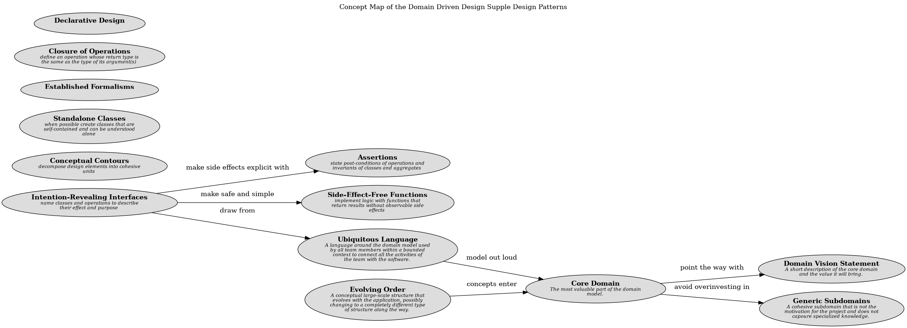

# Conceptual Contours (Concept)
## Description
decompose design elements into cohesive units

## Tags
pattern

## Documentation
Sometimes people chop functionality fine to allow flexible combination.
Sometimes they lump it large to encapsulate complexity. Sometimes they seek a
consistent granularity, making all classes and operations to a similar scale.
These are oversimplifications that don’t work well as general rules. But they
are motivated by basic problems.

When elements of a model or design are embedded in a monolithic construct,
their functionality gets duplicated. The external interface doesn’t say
everything a client might care about. Their meaning is hard to understand,
because different concepts are mixed together.

Conversely, breaking down classes and methods can pointlessly complicate the
client, forcing client objects to understand how tiny pieces fit together.
Worse, a concept can be lost completely. Half of a uranium atom is not uranium.
And of course, it isn’t just grain size that counts, but just where the grain
runs.

Therefore,

Decompose design elements (operations, interfaces, classes, and aggregates)
into cohesive units, taking into consideration your intuition of the important
divisions in the domain. Observe the axes of change and stability through
successive refactorings and look for the underlying conceptual contours that
explain these shearing patterns. Align the model with the consistent aspects of
the domain that make it a viable area of knowledge in the first place.

A supple design based on a deep model yields a simple set of interfaces that
combine logically to make sensible statements in the ubiquitous language, and
without the distraction and maintenance burden of irrelevant options.
## Other Relations
| From | Name | To | Description |
|---|---|---|---|
| [Model Driven Design](../../../software-development/domain-driven-design/modelling/c-model-driven-design.md) | reduce cost of change with | [Conceptual Contours](../../../software-development/domain-driven-design/supple-design/conceptual-contours.md) |  |

## Concept Map

[Concept Map of the Domain Driven Design Supple Design Patterns](../../../software-development/domain-driven-design/supple-design/concept-view.md)

## Navigation
[List of views in namespace](./views-in-namespace.md)

[List of all Views](../../../views.md)

(generated by [Overarch](https://github.com/soulspace-org/overarch) with template docs/node.md.cmb)
