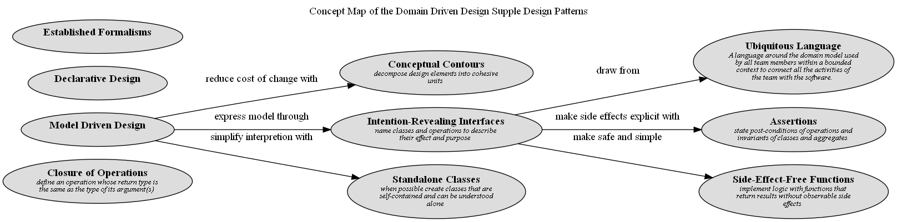

# Side-Effect-Free Functions (Concept)
## Description
implement logic with functions that return results without observable side effects

## Tags
pattern

## Documentation
Interactions of multiple rules or compositions of calculations become extremely
difficult to predict. The developer calling an operation must understand its
implementation and the implementation of all its delegations in order to
anticipate the result. The usefulness of any abstraction of interfaces is
limited if the developers are forced to pierce the veil. Without safely
predictable abstractions, the developers must limit the combinatory explosion,
placing a low ceiling on the richness of behavior that is feasible to build.

Therefore,

Place as much of the logic of the program as possible into functions,
operations that return results with no observable side effects. Strictly
segregate commands (methods which result in modifications to observable state)
into very simple operations that do not return domain information. Further
control side effects by moving complex logic into value objects when a concept
fitting the responsibility presents itself.

All operations of a value object should be side-effect-free functions.

## Concept Map

[Concept Map of the Domain Driven Design Supple Design Patterns](../../../software-development/domain-driven-design/supple-design/concept-view.md)

## Navigation
[List of views in namespace](./views-in-namespace.md)

[List of all Views](../../../views.md)

(generated by [Overarch](https://github.com/soulspace-org/overarch) with template docs/node.md.cmb)
