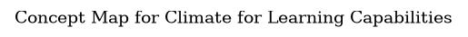

# Concept Map for Climate for Learning Capabilities

## Diagram

## Description
Shows the concepts related to climate for learning capabilities and their relationships.

## Navigation
[List of views in namespace](./views-in-namespace.md)

[List of all Views](../../../../views.md)

(generated by [Overarch](https://github.com/soulspace-org/overarch) with template docs/view.md.cmb)

