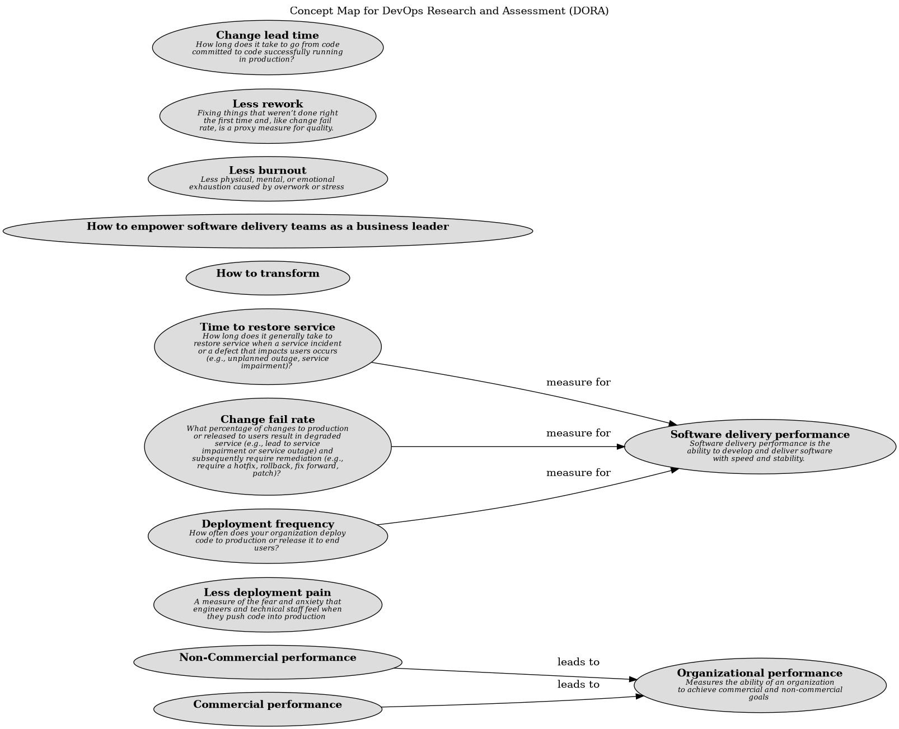

# Code maintainability (Concept)
## Description
Make it easy for developers to find, reuse, and change code, and keep dependencies up-to-date.

## Tags
capability, technical, core

## Documentation
It takes a lot of code to run the systems we build: The Android operating system runs on 12 to 15 million lines of code, Google’s monolithic code repository contains over 1 billion lines of code, and a typical smartphone app has 50,000 lines of code.

The 2019 State of DevOps Report from DevOps Research and Assessment (DORA) research shows that the ability of teams to maintain their code effectively is one of a number of technical practices that contribute positively to success with continuous delivery.

If your team is doing a good job with code maintainability, the following are true:

    * It’s easy for the team to find examples in the codebase, reuse other people’s code, and change code maintained by other teams if necessary.
    * It’s easy for the team to add new dependencies to their project, and to migrate to a new version of a dependency.
    * The team’s dependencies are stable and rarely break the code.

These findings highlight the importance of making it easy for developers to find, reuse, and change code across the whole organization’s codebase, and also of implementing practices and tools to help with dependency management.

Code maintainability is a capability that requires organization-wide coordination, since it relies on being able to search, reuse, and change other teams’ code. Managing dependencies effectively is often a major source of pain when working with large codebases and large organizations. Tooling that can help avoid problems with dependencies or illuminate the consequences of code changes can improve design decisions and code quality for all engineers, which in turn enables them to work faster and create more stable, reliable software.

## Other Relations
| From | Name | To | Description |
|---|---|---|---|
| [Code maintainability](../../software-development/dora/code-maintainability.md) | enables | [Climate for Learning](../../software-development/dora/climate-for-learning.md) |  |

## Concept Map

[Concept Map for DevOps Research and Assessment (DORA)](../../software-development/dora/concept-view.md)

## Navigation
[List of views in namespace](./views-in-namespace.md)

[List of all Views](../../views.md)

(generated by [Overarch](https://github.com/soulspace-org/overarch) with template docs/node.md.cmb)
