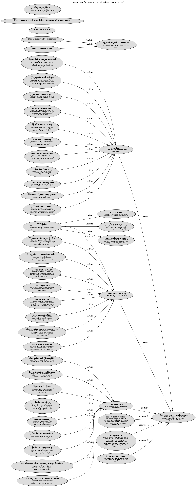

# Job satisfaction (Concept)
## Description
Find out about the importance of ensuring your people have the tools and resources to do their job, and of making good use of their skills and abilities.

## Tags
culture, capability

## Documentation
Early analysis performed by DevOps Research and Assessment (DORA) found that job satisfaction is a predictor of organizational performance. Having engaged employees doing meaningful work drives business value.

Everybody knows how job satisfaction feels. It’s about doing work that’s challenging and meaningful, and being empowered to exercise skills and judgment. Where there’s job satisfaction, employees bring the best of themselves to work: their engagement, their creativity, and their strongest thinking. The result is more innovation in any area of the business, including technology.

There’s a virtuous circle when it comes to the benefits of job satisfaction. People do better work when they feel supported by their employers, when they have the tools and resources to do their work, and when they feel their judgment is valued. Better work results in higher software delivery performance, which results in higher organizational performance.

This cycle of continuous improvement and learning is what sets successful companies apart, enabling them to innovate, get ahead of the competition, and win.
## Other Relations
| From | Name | To | Description |
|---|---|---|---|
| [Job satisfaction](../../software-development/dora/job-satisfaction.md) | enables | [Climate for Learning](../../software-development/dora/climate-for-learning.md) |  |

## Concept Map

[Concept Map for DevOps Research and Assessment (DORA)](../../software-development/dora/concept-view.md)

## Navigation
[List of views in namespace](./views-in-namespace.md)

[List of all Views](../../views.md)

(generated by [Overarch](https://github.com/soulspace-org/overarch) with template docs/node.md.cmb)
