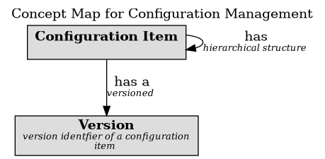

# Concept Map for Configuration Management

## Diagram

## Description
Shows the concepts of the ITIL 4 practice 'Configuration Management'

## Concepts
| Concept | Description |
|---|---|
| [Configuration Item](../../../software-development/itil4/configuration-managment/config-item.md)|  |
| [Version](../../../software-development/itil4/configuration-managment/version.md)| version identfier of a configuration item |

## Features
| From | Name | To | Description |
|---|---|---|---|
| [Configuration Item](../../../software-development/itil4/configuration-managment/config-item.md) | has | [Configuration Item](../../../software-development/itil4/configuration-managment/config-item.md) | hierarchical structure |
| [Configuration Item](../../../software-development/itil4/configuration-managment/config-item.md) | has a | [Version](../../../software-development/itil4/configuration-managment/version.md) | versioned |

## Navigation
[List of views in namespace](./views-in-namespace.md)

[List of all Views](../../../views.md)

(generated by [Overarch](https://github.com/soulspace-org/overarch) with template docs/view.md.cmb)

