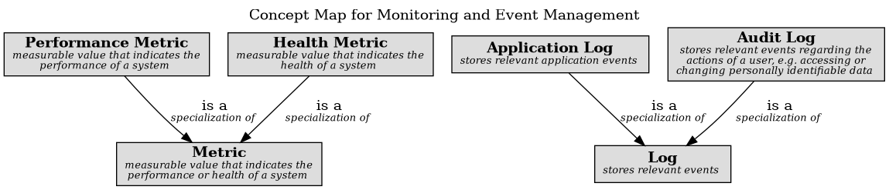

# Log (Concept)
## Description
stores relevant events

## Subordinates
| Concept | Description |
|---|---|
| [Application Log](../../../software-development/itil4/monitoring/app-log.md)| stores relevant application events |
| [Audit Log](../../../software-development/itil4/monitoring/audit-log.md)| stores relevant events regarding the actions of a user, e.g. accessing or changing personally identifiable data |

## Concept Map

[Concept Map for Monitoring and Event Management](../../../software-development/itil4/monitoring/concept-view.md)

## Navigation
[List of views in namespace](./views-in-namespace.md)

[List of all Views](../../../views.md)

(generated by [Overarch](https://github.com/soulspace-org/overarch) with template docs/node.md.cmb)
