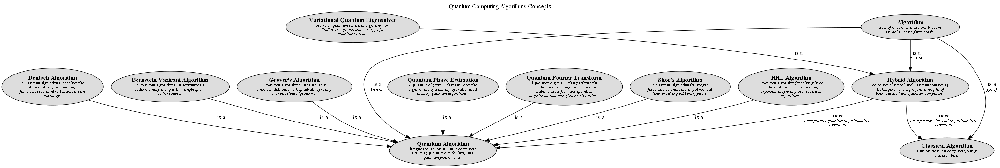

# Quantum Computing Algorithms Concepts

## Diagram

## Description
contains concepts related to quantum computing algorithms, including classical, quantum, and hybrid algorithms.

## Concepts
| Concept | Description |
|---|---|
| [Algorithm](../../../software-development/quantum-computing/algorithm/algorithm.md)| a set of rules or instructions to solve a problem or perform a task. |
| [Bernstein-Vazirani Algorithm](../../../software-development/quantum-computing/algorithm/bernstein-vazirani-algorithm.md)| A quantum algorithm that determines a hidden binary string with a single query to the oracle. |
| [Classical Algorithm](../../../software-development/quantum-computing/algorithm/classical-algorithm.md)| runs on classical computers, using classical bits. |
| [Deutsch Algorithm](../../../software-development/quantum-computing/algorithm/deutsch-algorithm.md)| A quantum algorithm that solves the Deutsch problem, determining if a function is constant or balanced with one query. |
| [Grover's Algorithm](../../../software-development/quantum-computing/algorithm/grover-algorithm.md)| A quantum algorithm that searches an unsorted database with quadratic speedup over classical algorithms. |
| [HHL Algorithm](../../../software-development/quantum-computing/algorithm/hhl-algorithm.md)| A quantum algorithm for solving linear systems of equations, providing exponential speedup over classical algorithms. |
| [Hybrid Algorithm](../../../software-development/quantum-computing/algorithm/hybrid-algorithm.md)| combines classical and quantum computing techniques, leveraging the strengths of both classical and quantum computers. |
| [Quantum Algorithm](../../../software-development/quantum-computing/algorithm/quantum-algorithm.md)| designed to run on quantum computers, utilizing quantum bits (qubits) and quantum phenomena. |
| [Quantum Fourier Transform](../../../software-development/quantum-computing/algorithm/quantum-fourier-transform.md)| A quantum algorithm that performs the discrete Fourier transform on quantum states, crucial for many quantum algorithms, including Shor's algorithm. |
| [Quantum Phase Estimation](../../../software-development/quantum-computing/algorithm/quantum-phase-estimation.md)| A quantum algorithm that estimates the eigenvalues of a unitary operator, used in many quantum algorithms. |
| [Shor's Algorithm](../../../software-development/quantum-computing/algorithm/shor-algorithm.md)| A quantum algorithm for integer factorization that runs in polynomial time, breaking RSA encryption. |
| [Variational Quantum Eigensolver](../../../software-development/quantum-computing/algorithm/variational-quantum-eigensolver.md)| A hybrid quantum-classical algorithm for finding the ground state energy of a quantum system. |

## Generalizations
| From | Name | To | Description |
|---|---|---|---|
| [Shor's Algorithm](../../../software-development/quantum-computing/algorithm/shor-algorithm.md) | is a | [Quantum Algorithm](../../../software-development/quantum-computing/algorithm/quantum-algorithm.md) |  |
| [Algorithm](../../../software-development/quantum-computing/algorithm/algorithm.md) | is a | [Classical Algorithm](../../../software-development/quantum-computing/algorithm/classical-algorithm.md) | type of |
| [HHL Algorithm](../../../software-development/quantum-computing/algorithm/hhl-algorithm.md) | is a | [Quantum Algorithm](../../../software-development/quantum-computing/algorithm/quantum-algorithm.md) |  |
| [Bernstein-Vazirani Algorithm](../../../software-development/quantum-computing/algorithm/bernstein-vazirani-algorithm.md) | is a | [Quantum Algorithm](../../../software-development/quantum-computing/algorithm/quantum-algorithm.md) |  |
| [Variational Quantum Eigensolver](../../../software-development/quantum-computing/algorithm/variational-quantum-eigensolver.md) | is a | [Hybrid Algorithm](../../../software-development/quantum-computing/algorithm/hybrid-algorithm.md) |  |
| [Algorithm](../../../software-development/quantum-computing/algorithm/algorithm.md) | is a | [Hybrid Algorithm](../../../software-development/quantum-computing/algorithm/hybrid-algorithm.md) | type of |
| [Quantum Phase Estimation](../../../software-development/quantum-computing/algorithm/quantum-phase-estimation.md) | is a | [Quantum Algorithm](../../../software-development/quantum-computing/algorithm/quantum-algorithm.md) |  |
| [Algorithm](../../../software-development/quantum-computing/algorithm/algorithm.md) | is a | [Quantum Algorithm](../../../software-development/quantum-computing/algorithm/quantum-algorithm.md) | type of |
| [Quantum Fourier Transform](../../../software-development/quantum-computing/algorithm/quantum-fourier-transform.md) | is a | [Quantum Algorithm](../../../software-development/quantum-computing/algorithm/quantum-algorithm.md) |  |
| [Grover's Algorithm](../../../software-development/quantum-computing/algorithm/grover-algorithm.md) | is a | [Quantum Algorithm](../../../software-development/quantum-computing/algorithm/quantum-algorithm.md) |  |
| [Deutsch Algorithm](../../../software-development/quantum-computing/algorithm/deutsch-algorithm.md) | is a | [Quantum Algorithm](../../../software-development/quantum-computing/algorithm/quantum-algorithm.md) |  |

## Features
| From | Name | To | Description |
|---|---|---|---|
| [Hybrid Algorithm](../../../software-development/quantum-computing/algorithm/hybrid-algorithm.md) | uses | [Classical Algorithm](../../../software-development/quantum-computing/algorithm/classical-algorithm.md) | incorporates classical algorithms in its execution |
| [Hybrid Algorithm](../../../software-development/quantum-computing/algorithm/hybrid-algorithm.md) | uses | [Quantum Algorithm](../../../software-development/quantum-computing/algorithm/quantum-algorithm.md) | incorporates quantum algorithms in its execution |

## Navigation
[List of views in namespace](./views-in-namespace.md)

[List of all Views](../../../views.md)

(generated by [Overarch](https://github.com/soulspace-org/overarch) with template docs/view.md.cmb)

