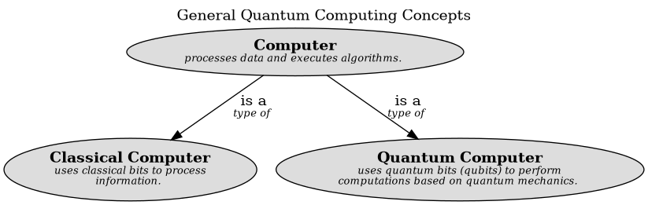

# Classical Computer (Concept)
## Description
uses classical bits to process information.

## Subordinates
| Concept | Description |
|---|---|
| [Computer](../../software-development/quantum-computing/computer.md)| processes data and executes algorithms. |
## Other Relations
| From | Name | To | Description |
|---|---|---|---|
| [Classical Computer](../../software-development/quantum-computing/classical-computer.md) | runs | [Classical Algorithm](../../software-development/quantum-computing/classical-algorithm.md) | executes classical algorithms |

## Concept Map

[General Quantum Computing Concepts](../../software-development/quantum-computing/concept-view.md)

## Navigation
[List of views in namespace](./views-in-namespace.md)

[List of all Views](../../views.md)

(generated by [Overarch](https://github.com/soulspace-org/overarch) with template docs/node.md.cmb)
