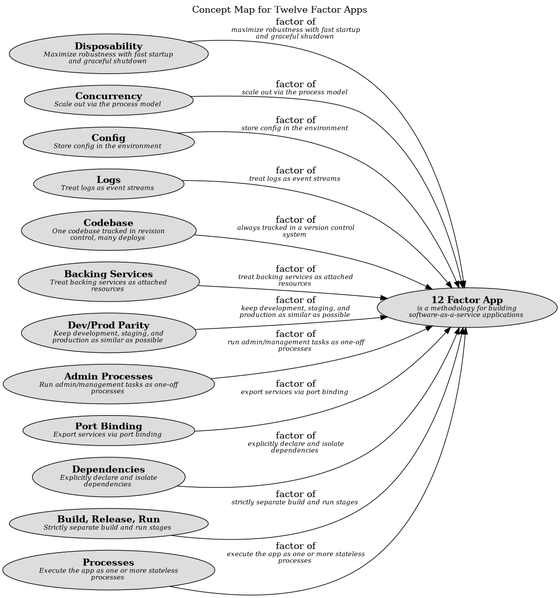

# 12 Factor App (Concept)
## Description
is a methodology for building software-as-a-service applications

## Documentation
In the modern era, software is commonly delivered as a service: called web apps,
or software-as-a-service. The twelve-factor app is a methodology for building
software-as-a-service apps that:

* Use declarative formats for setup automation, to minimize time and cost for new developers joining the project;
* Have a clean contract with the underlying operating system, offering maximum portability between execution environments;
* Are suitable for deployment on modern cloud platforms, obviating the need for servers and systems administration;
* Minimize divergence between development and production, enabling continuous deployment for maximum agility;
* And can scale up without significant changes to tooling, architecture, or development practices.

The twelve-factor methodology can be applied to apps written in any programming language,
and which use any combination of backing services (database, queue, memory cache, etc).
## Other Relations
| From | Name | To | Description |
|---|---|---|---|
| [Concurrency](../../software-development/twelve-factor-app/concurrency.md) | factor of | [12 Factor App](../../software-development/twelve-factor-app/twelve-factor-app.md) | scale out via the process model |
| [Processes](../../software-development/twelve-factor-app/processes.md) | factor of | [12 Factor App](../../software-development/twelve-factor-app/twelve-factor-app.md) | execute the app as one or more stateless processes |
| [Config](../../software-development/twelve-factor-app/config.md) | factor of | [12 Factor App](../../software-development/twelve-factor-app/twelve-factor-app.md) | store config in the environment |
| [Backing Services](../../software-development/twelve-factor-app/backing-services.md) | factor of | [12 Factor App](../../software-development/twelve-factor-app/twelve-factor-app.md) | treat backing services as attached resources |
| [Disposability](../../software-development/twelve-factor-app/disposability.md) | factor of | [12 Factor App](../../software-development/twelve-factor-app/twelve-factor-app.md) | maximize robustness with fast startup and graceful shutdown |
| [Dev/Prod Parity](../../software-development/twelve-factor-app/dev-prod-parity.md) | factor of | [12 Factor App](../../software-development/twelve-factor-app/twelve-factor-app.md) | keep development, staging, and production as similar as possible |
| [Logs](../../software-development/twelve-factor-app/logs.md) | factor of | [12 Factor App](../../software-development/twelve-factor-app/twelve-factor-app.md) | treat logs as event streams |
| [Admin Processes](../../software-development/twelve-factor-app/admin-processes.md) | factor of | [12 Factor App](../../software-development/twelve-factor-app/twelve-factor-app.md) | run admin/management tasks as one-off processes |
| [Codebase](../../software-development/twelve-factor-app/codebase.md) | factor of | [12 Factor App](../../software-development/twelve-factor-app/twelve-factor-app.md) | always tracked in a version control system |
| [Dependencies](../../software-development/twelve-factor-app/dependencies.md) | factor of | [12 Factor App](../../software-development/twelve-factor-app/twelve-factor-app.md) | explicitly declare and isolate dependencies |
| [Build, Release, Run](../../software-development/twelve-factor-app/build-release-run.md) | factor of | [12 Factor App](../../software-development/twelve-factor-app/twelve-factor-app.md) | strictly separate build and run stages |
| [Port Binding](../../software-development/twelve-factor-app/port-binding.md) | factor of | [12 Factor App](../../software-development/twelve-factor-app/twelve-factor-app.md) | export services via port binding |

## Concept Map

[Twelve Factor App Concept Map](../../software-development/twelve-factor-app/concept-view.md)

## Navigation
[List of views in namespace](./views-in-namespace.md)

[List of all Views](../../views.md)

(generated by [Overarch](https://github.com/soulspace-org/overarch) with template docs/node.md.cmb)
